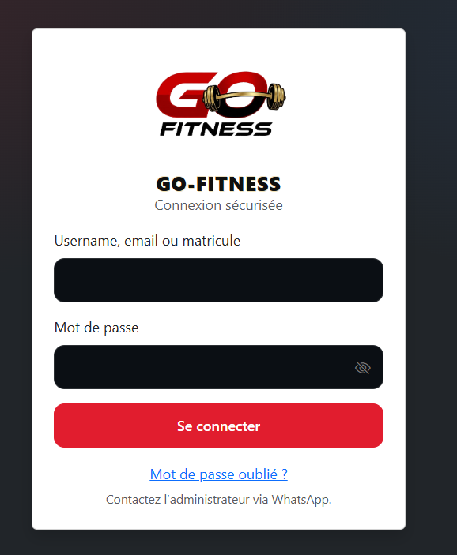
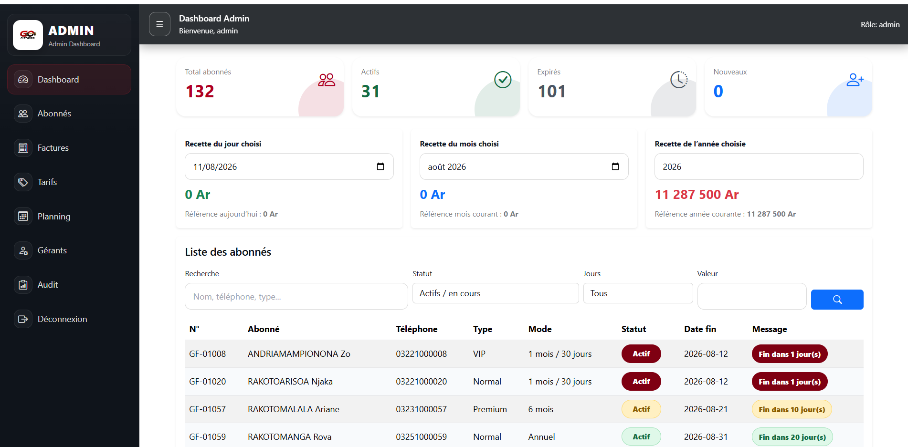
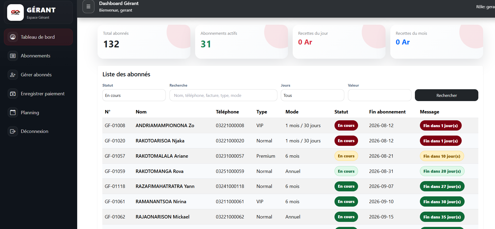
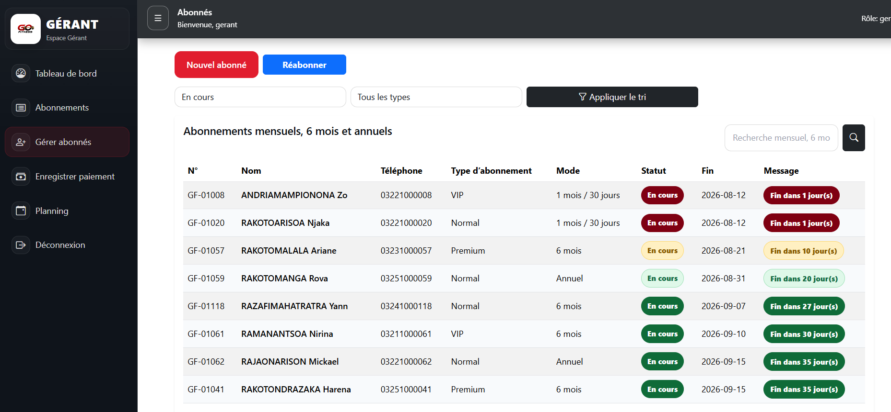

# GO-FITNESS

Application de gestion de salle de sport développée en PHP natif. 
Permet la gestion des abonnés, des abonnements, des paiements et des factures pour les rôles Admin et Gérant.

##  Fonctionnalités principales

- **Gestion des rôles**: Espace Admin et espace Gérant séparés
- **Gestion des abonnés**: Ajout, modification, suivi des jours restants
- **Gestion des abonnements**: Mensuel, Trimestriel, Semestriel, Annuel
- **Enregistrement des paiements**: Calcul automatique + génération de facture
- **Dashboard**: Statistiques en temps réel: Total abonnés, Recettes du jour

##  Aperçu de l'application

### 1. Authentification
Page de connexion sécurisée pour Admin et Gérant

### 2. Dashboard Admin
Vue globale: Total abonnés, Abonnements actifs, Recettes du jour

### 3. Dashboard Gérant
Suivi des activités et des abonnés du gérant

### 4. Gestion des Abonnés
Liste avec calcul automatique des jours restants et statut

##  Technologies utilisées
- **Backend**: PHP
- **Base de données**: MySQL
- **Frontend**: HTML, CSS, JavaScript

## Auteur
Développé par RANAIVOMANANA LEVASOA
